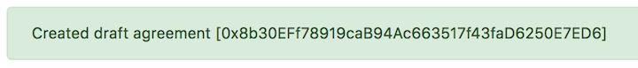
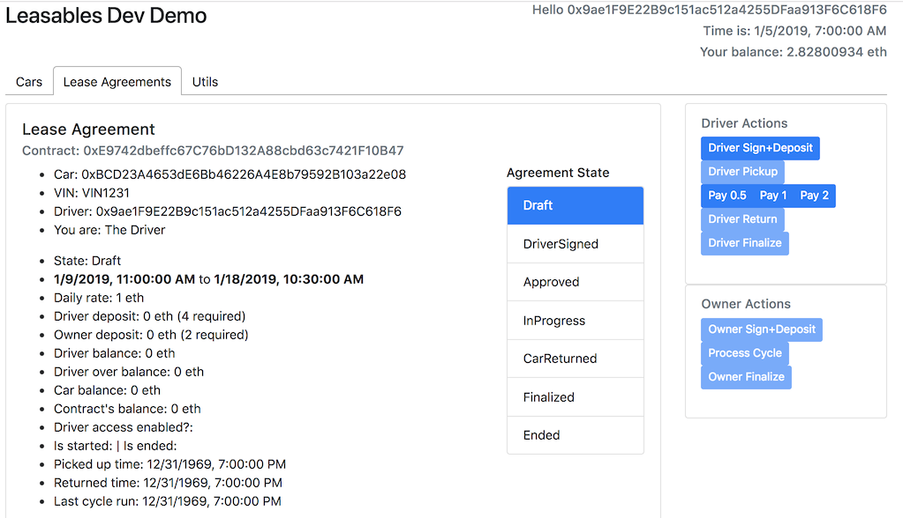
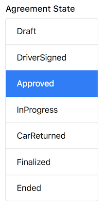

# Leasables Demo

NOTE: This demo UI is very rudimentary and not easy on the eyes. It has a data oriented user experience and often requires manual page refreshes since all back-end data changes are not always fully reflected on the UI immediately.

The UI is organized with 3 tabs: 
1. **Cars**: Lookup existing cars and request draft lease agreements
2. **Lease Agreements**: Lookup existing agreements, sign, deposit, process, return, finalize etc. 
3. **Utils**: Connection status details, list of available accounts and a time machine (a tool for testing).
 
## Cars

Lookup an existing car by its address by using one of the sample cars created as part of the `truffle deploy` step in dev setup. Try `0xBCD23A4653dE6Bb46226A4E8b79592B103a22e08` or `0x8B207a3fc32ae8907966AB51C8079fD079C54ACA`

NOTE: The "Recent Cars" and "Recent Agreements" lists are for convenience only and the data is not stored on chain, just in local browser storage.

You can request a "Draft Lease Agreement" with a start & end date & time. It will display the address of the newly created agreement in a confirmation message. It will also be added to the "Recent Agreements" list

Switch over to the "Lease Agreements" tab to view it. (You'll see the address of the new contract in the recent list)

The details of the agreement are on the left side. The latest known state of the agreement: 

The driver's available actions based on the state of the agreement:

The owner's available actions based on the state of the agreement:

### Utilities
For dev, debugging, testing and demo use ONLY!
* Time Travel: Tool for test only.
* Connection status: For debugging connection to the chain
* Available Accounts: Easily switch state to different accounts when working from a local chain without metamask

## Lifecycle of a Lease Agreement 

An agreement transitions thru the following states:
 1. Draft
 2. Driver Signed
 3. Approved
 4. InProgress
 5. Car Returned
 6. Finalized
 7. Ended

### Draft
  * Created by Car at the request of an interested driver
  * The contract has no funds in it or commitments made. Just a draft for review.
  * The car will create draft contracts by its choice based on availability, pricing and driver reputation

### DriverSigned
  * Driver has signed the agreement by putting down the required deposit

### Committed
  * Owner has signed and put in promise deposit
  * Driver and the car now have a committed agreement for a lease
  
### InProgress
  * Driver has picked up the car and the clock is running

### CarReturned
  * Driver has returned the car by transferring possession as defined in the agreement.
  * Driver may still own money to the agreement.
  * The condition of the returned car needs to be validated by the owner
  
### Finalized
  * Owner has finalized the agreement. 
  * Driver's deposit and any other remaining balance will be used to settle balances
  * This also triggers:
    * Car's funds earned from the lease agreement are transfered to the car contract
    * Owner's promise deposit is refunded

### Ended
  * Driver has withdrawn deposit and any remaining funds from the agreement.
  * The agreement is over and contract is read-only now.

