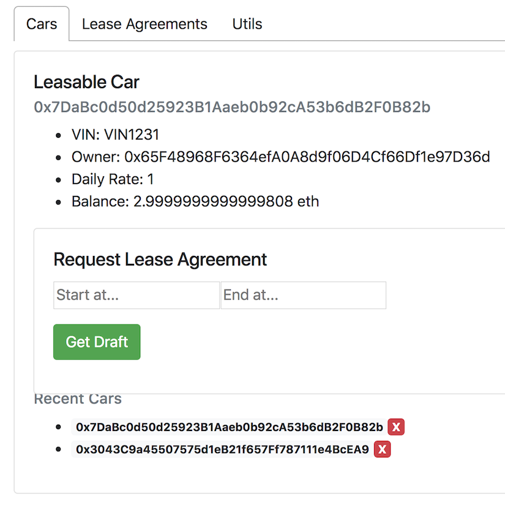

# Leasables Demo

NOTE: This demo UI is very rudimentary and not easy on the eyes. It has a data oriented user experience and often requires manual page refreshes since all back-end data changes are not always fully reflected on the UI immediately.

The UI is organized with 3 tabs: 
    1] Cars: Lookup existing cars and request draft lease agreements
    2] Lease Agreements: Lookup existing agreements, sign, deposit process, return, finalize etc. 
    3] Utils: Connection status details, list of available accounts and a time machine (a tool for testing).
 
## Cars

Lookup an existing car by its address by using one of the sample cars created as part of the `truffle deploy` step in dev setup.    

NOTE: The "Recent Cars" list is for convienence only. It is not stored on chain, just in local browser storage.

You can request a "Draft Lease Agreement" with a start & end date & time. It will display the address of the newly created agreement in a confirmation message. It will also be added to the "Recent Agreements" list

Switch over to the "Lease Agreements" tab to view it.
